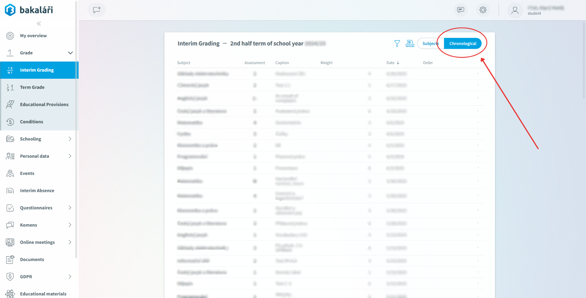

<p align="center">
  
</p>

# AutoBaka App

**AutoBaka** is a simple desktop/CLI app that calculates your average grades from Bakaláři.

---

## Table of Contents

- [AutoBaka App](#autobaka-app)
  - [Table of Contents](#table-of-contents)
  - [About the Project](#about-the-project)
    - [Functions](#functions)
    - [Variants](#variants)
  - [Getting started](#getting-started)
  - [Installation](#installation)
  - [Requirements](#requirements)
  - [Usage](#usage)
    - [Run main script](#run-main-script)
      - [Procedure with WINDOWS 11](#procedure-with-windows-11)
  - [Examples](#examples)
  - [Features](#features)
  - [Contributing](#contributing)
  - [Known Issues](#known-issues)
  - [FAQ](#faq)
  - [License](#license)
  - [Authors](#authors)
  - [Changelog](#changelog)
  - [Planned](#planned)

---

## About the Project

The user enters their login credentials to Bakaláři system. The app uses Selenium to log into the Bakaláři website and fetches your data to your PC

### Functions

1. Calculating grades

    > Ideal for students whose school has hidden the average and who just don’t want to calculate them manually.

2. Calculating absense

    > It quickly shows you how many lessons you will miss, and gives your absence percentage — without using Bakaláři system. 
    > ⚠️ **Note:** Be cautious - some lessons may be replaced, cancelled, or rescheduled. The data is based on your current timetable.

### Variants

| Variant   | Stable | UI | CLI | Script | Version |
|---------|--------|------|-----|--------|---------|
| Windows 11| ✅ | ❌ | ✅ | ✅ | 1.2.0 |
| Android | ❌ | ❌ | ❌ | ❌ | 0 |
| Website | ❌ | ❌ | ❌ | ❌ | 0 |
| Only main script| ✅ | ❌ | ❌ | ❌ | 1.2.0 |

- UI destop (windows/linux/macOS) Soon!
- CLI (windows/linux/macOS) Soon!
- Mobile (android/IOS) Soon!
- Website <https://autobaka.cz>

---

## Getting started

To try the app, download the repository from <https://github.com/bag1s3k/AutoBaka>

---

## Installation

```bash
git clone https://github.com/bag1s3k/AutoBaka.git
```

---

## Requirements

These are the versions that I currently use.  
You can try others, but compatibility is not guaranteed. **(I have never tried)**


  


---

## Usage

### Run main script

Just get your average grades without any interface  

#### Procedure with WINDOWS 11

- **Setup an app**

    1. Set your login details to `config\.env`

        ```dotenv
        BAKA_USERNAME=username
        BAKA_PASSWORD=password
        ```

    2. Setup config to `config\config.ini`

        ```ini
        [PATHS]
        result_path = c:\example\result.txt
        ```

        ```ini
        [URLS]
        login_url = https://baka.website/login # login page
        marks_url = https://baka.website/next/prubzna.aspx?s=chrono
        ```

        > `marks_url` Login to your bakaláři website interface > Grade > Interim Grading > Chronological button and **copy url**

        <p align="left">
          
        </p>

        ```ini
        [SETTINGS]
        timeout = 15 # default and required but you can try different
        headless_mode = True # Wanna see what is happening
        quit_driver = True # If you wanna close the window after the program end
        export_format = json # there are grades stored ["json", "txt", "xaml", "csv"]
        ```

- **Using virtual environment `.venv`**

    1. Download all required libraries from `requirements.txt` ⚠️*while you are installing requirements you have to be in project root*

        ```bash
        pip install -r requirements.txt
        ```

    2. Activate virtual enviroment `.venv`

        ```bash
        cd C:\example\autobaka 
        ```

       ```bash
       .\.venv\Scripts\activate.ps1
       ```

        You should see `(.venv)` before your path

        ```bash
        (.venv) C:\example\autobaka>
        ```

    3. Run script `main.py` using login details from `.env`

        ```bash
        python main.py
        ```

        ***Possible options:***  
        - `"--loing", "-l"` by using this one you have to enter your login details **username password**

          ```bash
          python main.py --login username password # --login or -l to use login details from cmd
          ```

---

## Examples

```bash
PS C:\local\work\Download> cd C:\local\work\autobaka # Move to the project root
PS C:\local\work\autobaka> .\.venv\Scripts\activate.ps1 # Activate .venv
````

**Login details from `.env`**

```bash
(.venv) PS C:\local\work\autobaka> python main.py
.
DevTools listening on ws://127.0.0.1:xxxxx/devtools/browser/xxxxxxxx-xxxx-xxxx-xxxx-xxxxxxxxxxxx
....... Successfully
(.venv) PS C:\local\work\autobaka>
```

**Login details from cmd**

```bash
(.venv) PS C:\local\work\autobaka> python main.py -l username password
.
DevTools listening on ws://127.0.0.1:xxxxx/devtools/browser/xxxxxxxx-xxxx-xxxx-xxxx-xxxxxxxxxxxx
....... Successfully
(.venv) PS C:\local\work\autobaka>
```

---

## Features

- [x] Your average grades
- [x] Absence calculator
- [x] Impleneted AI chatbot

---

## Contributing

Contributions are welcome! Open an issue, fork the repository, make improvements, and create a pull request.

---

## Known Issues

- [ ] while running only a main script it shows `DevTools listening on ws://127.0.0.1:xxxxx/devtools/browser/xxxxxxxx-xxxx-xxxx-xxxx-xxxxxxxxxxxx`, and there is 1 dot before this message, I wanna delete it
- [ ] there are for sure a lot of improvements and issues in the repository, but I'm still adding new features, I'm not interested in finding bugs and improvements

---

## FAQ

---

## License

See [LICENSE](LICENSE) for details.

## Authors

<div style="display: flex; align-items: center; gap: 10px;">

  

  <p style="margin: 0; font-size: 15pt;">
    Created by <a href="https://github.com/bag1s3k" style="font-weight:bold;">bag1s3k</a>
  </p>
  
</div>

---

## Changelog

- **1.0.0** - initial release
- **1.1.0** - added functional headless mode
- **1.1.1** - added logs `project_log.log`
- **1.2.1** - added options `--file` or `--user`

---

## Planned

- change language
- complete CLI
- desktop version (windows, ubuntu, macOS?)
- mobile version (android, IOS?)
- absence planner
- baka clone
- API
- server
- don't be like bot...